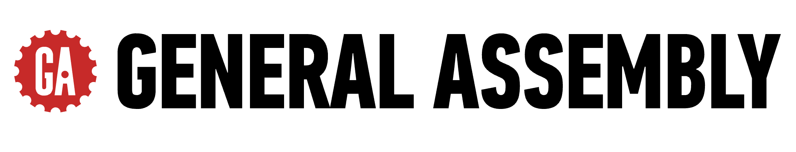

# General Assembly | Curriculum Development

A **private development workspace** for GA's curriculum team and contracted developers. It holds new and in-progress content — it is **not** a student or public resource.

> **Students:** you are in the wrong place. Nothing here is finished or meant for learners. Your program materials are in your own cohort's repository — watch for a GitHub email invitation, or ask your instructor.

---

<strong>Need access? (GA staff or contracted developers)</strong>

1. Have a **personal GitHub account** with **two-factor authentication (2FA) enabled** — https://github.com/settings/security
2. [Email/Slack (TBD)](#) with your **role** and the **program** you are working on.

Once approved, you will receive a GitHub invitation to the Org.

---

For anything not covered here, contact General Assembly through your existing point of contact.